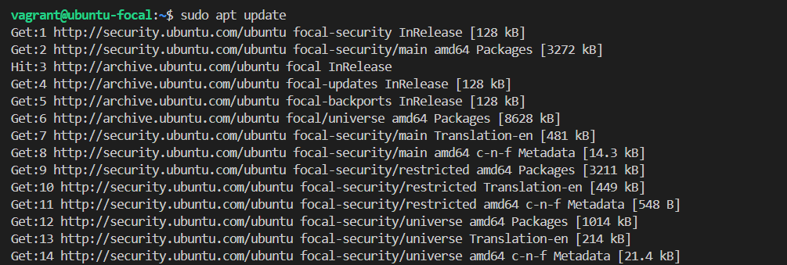
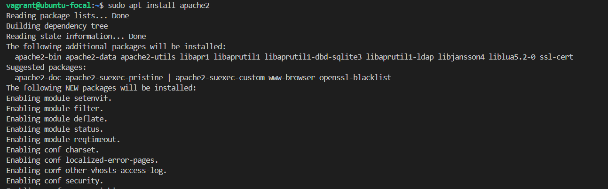
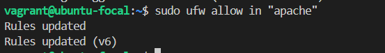
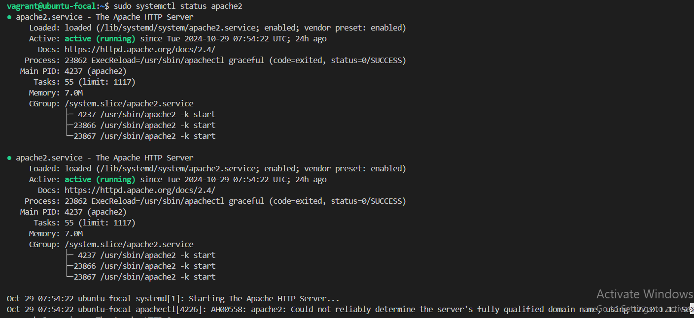
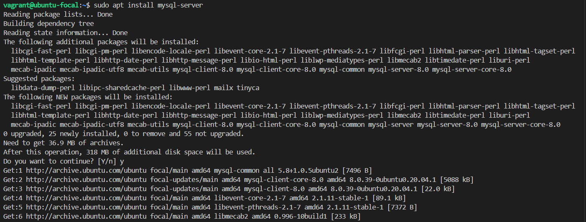
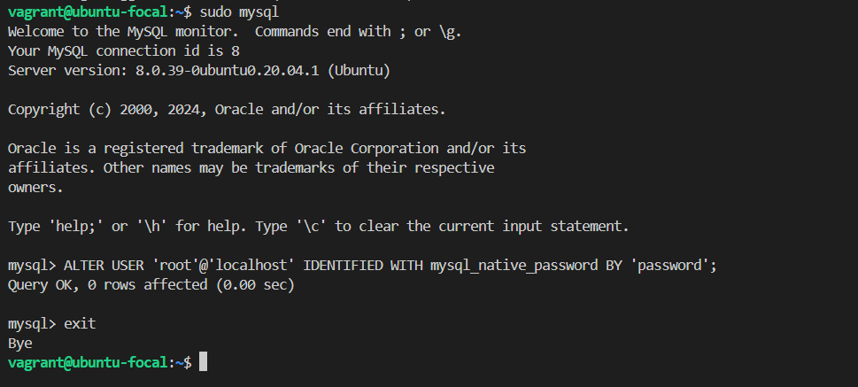
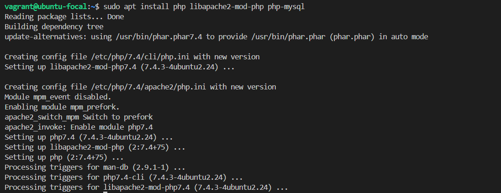
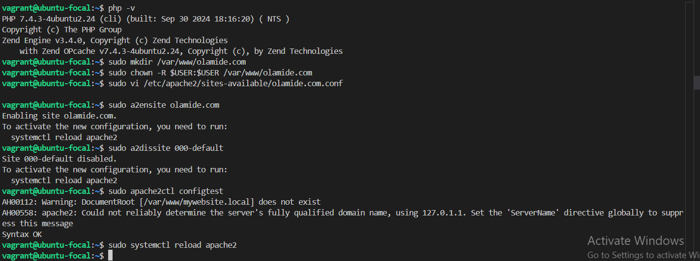
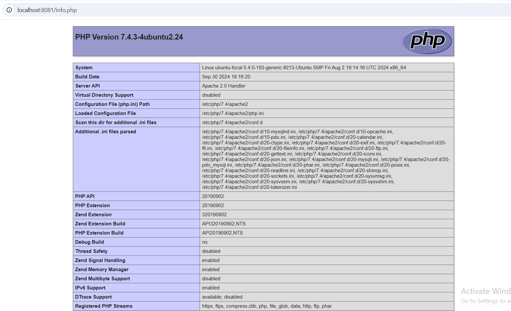

# INSTALLING APACHE AND UPDATING THE FIREWALL

Update the package manager cache

Apache install

Allow HTTP traffic through the firewall

Verify apache installation

apache default page

# Install Mysql

Connecting to Mysql as the root user using sudo mysql and changing the root user's authentication method.

# Installing PHP

Installing PHP and the required modules using **sudo apt install php libapache2-mod-php php-mysql**

# Creating a virtual host for your website

# Testing PHP processing on your webserver

