# Installing the Nginx Web server

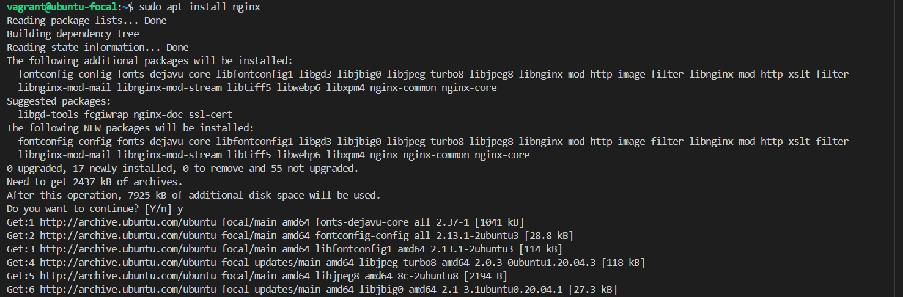

### Checking the uncomplicated firewall (UFW) profiles available and allowing connection to Nginx

### To test if the server is up and running, I will access my server’s domain name or public IP address in your web browser. Since i dont have a domain name, i can use my server's public IP address

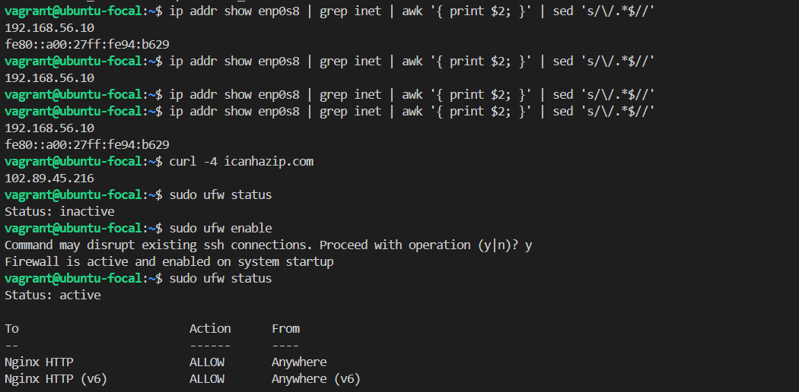

### Nginx default landing page

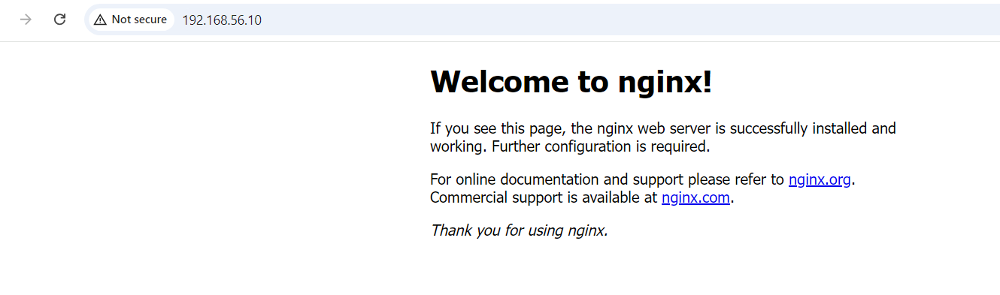

# Installing Mysql

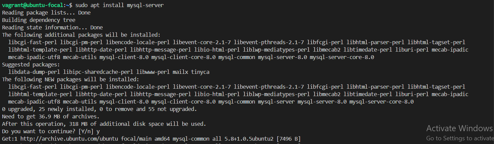

### connecting to the MySQL server as the administrative database user root

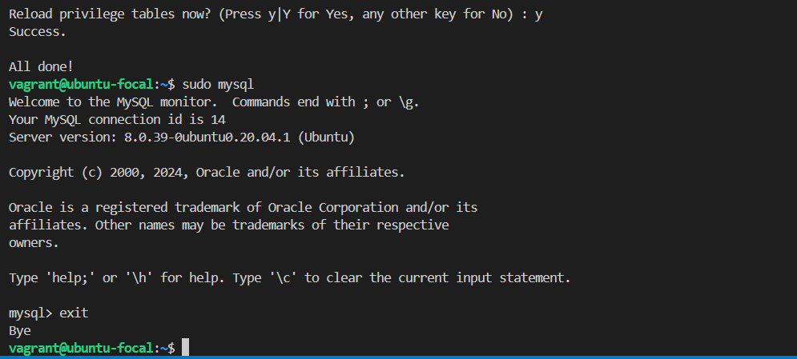

# Installing PHP

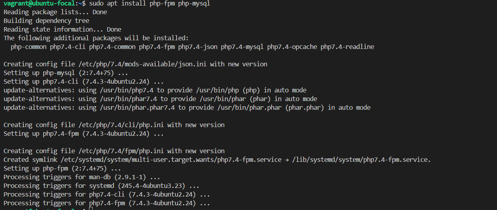

# Configuring Nginx to use the PHP processor

### Create the root web directory for your_domain and assigning ownership of the directory with the $USER environment variable

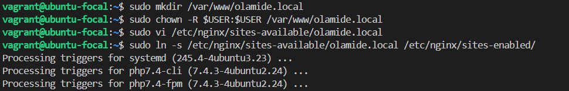

### landing page

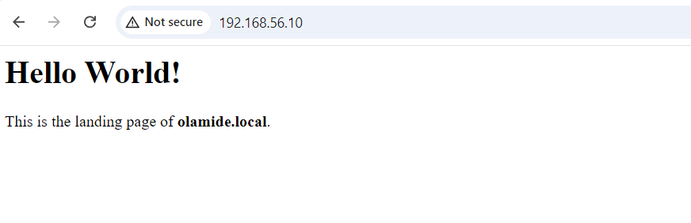

# Testing PHP with Nginx

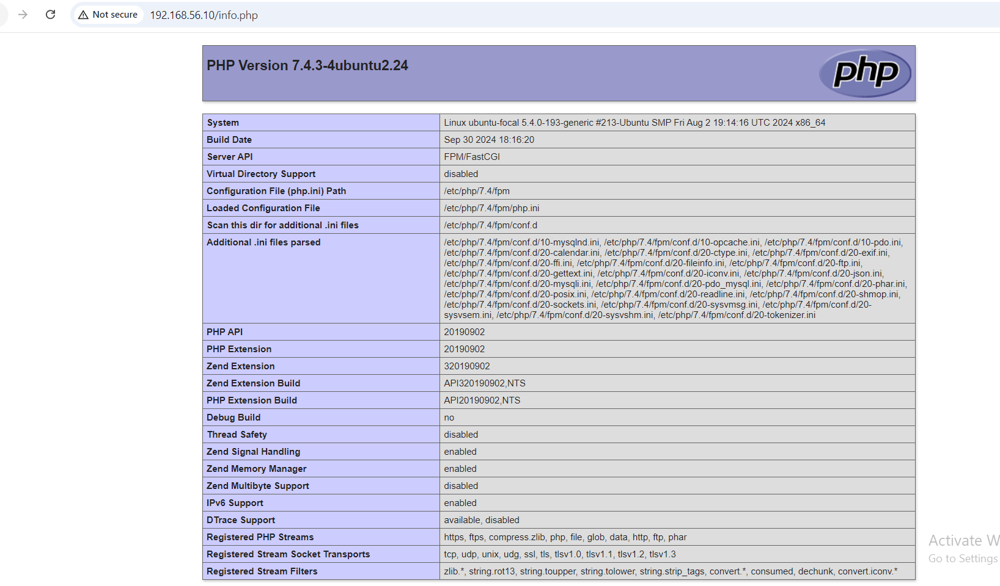

# testing Database Connection from PHP

* Showing the database
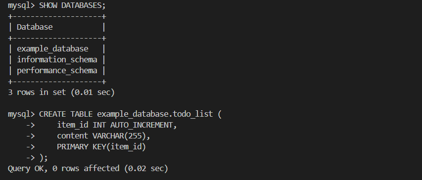

* Creating the todo list table
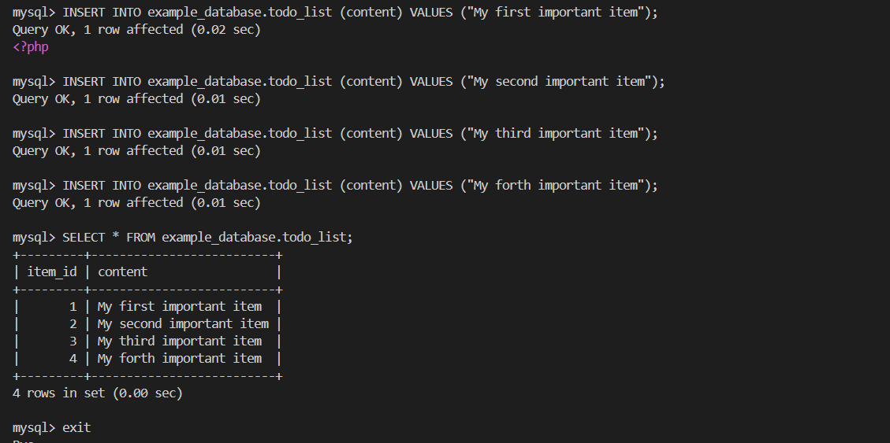

* accesing the PHP on the web browser
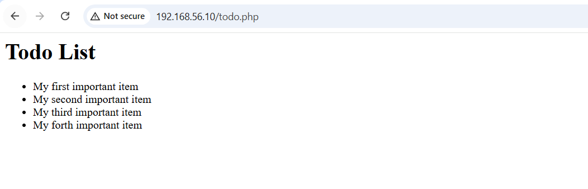
