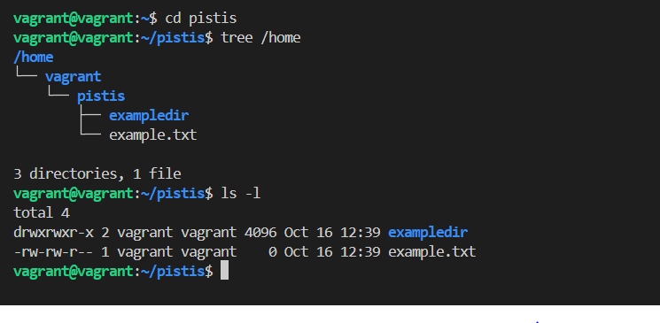
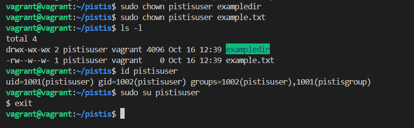

# attached below are Screenshots of the project implementation
 ## 1. Creating files and folder in the pistis directory and listing out pistis content.

 

 ## 2. Changing the permission of the file and document and then adding user "pistisuser" and group "pistisgroup". Also changing ownership from the root user "vagrant" to the new user "pistisuser" and finally switching to pistisuser

 