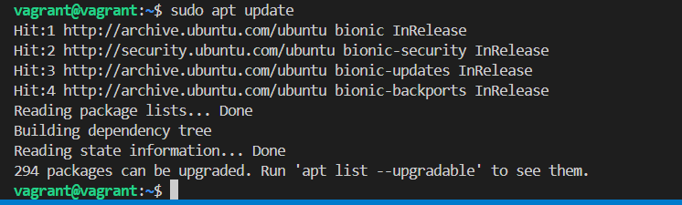
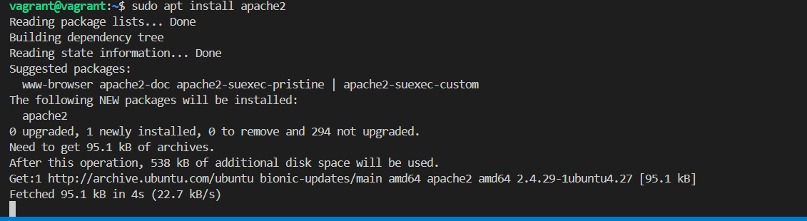
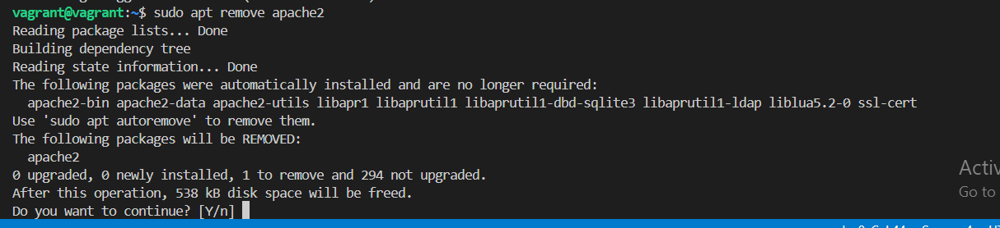
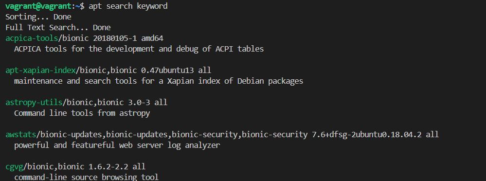
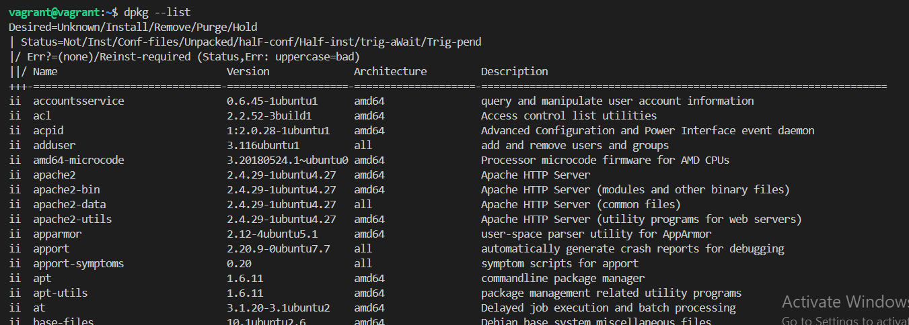
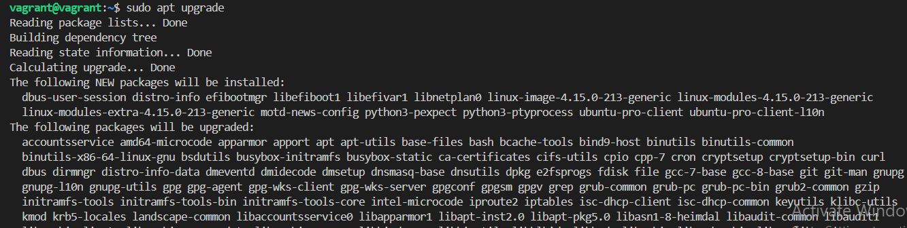

# Attached below are screenshots from the package management project

## 1. Updating of package repositories using - **<u>sudo apt update</u>**

## 2. Installing a package using - **<u>sudo apt install apache2</u>**

## 3. Removing a apache2 that was installed using - **<u>sudo apt remove apache2</u>**

## 4. Searching for package using - **<u>apt serach keyword</u>**

## 5. Listing installed packages using - **<u>dpkg --list</u>**

## 6. Upgrading installed packages using - **<u>sudo apt upgrade</u>**

