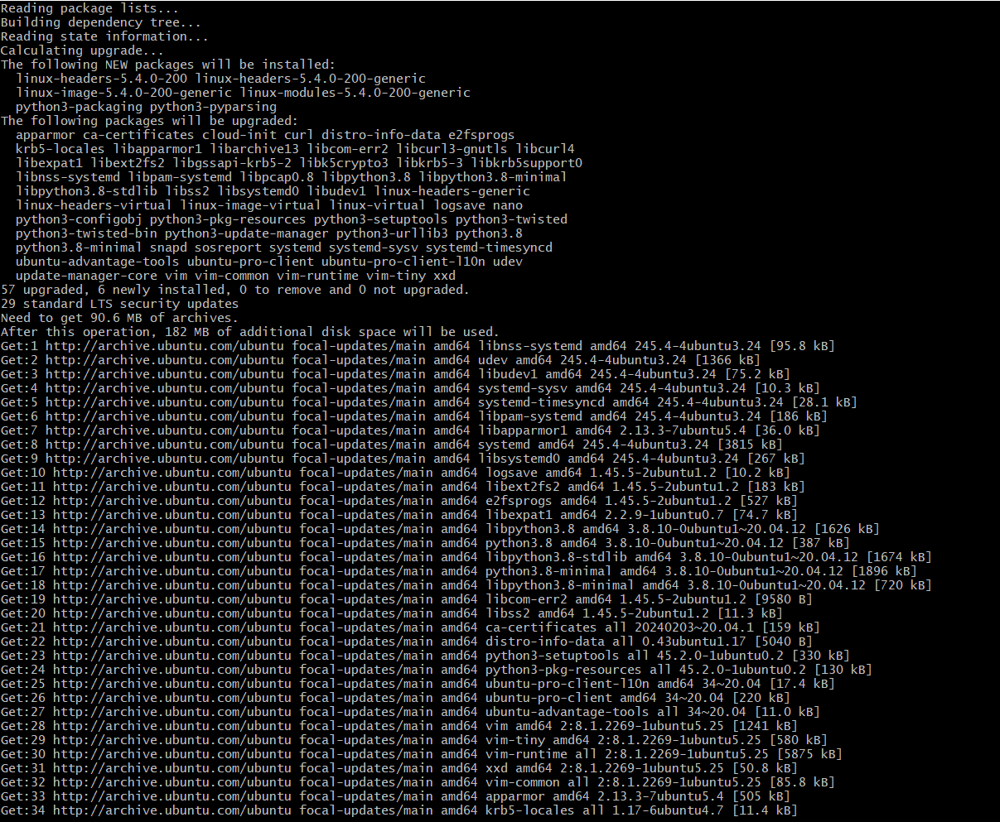
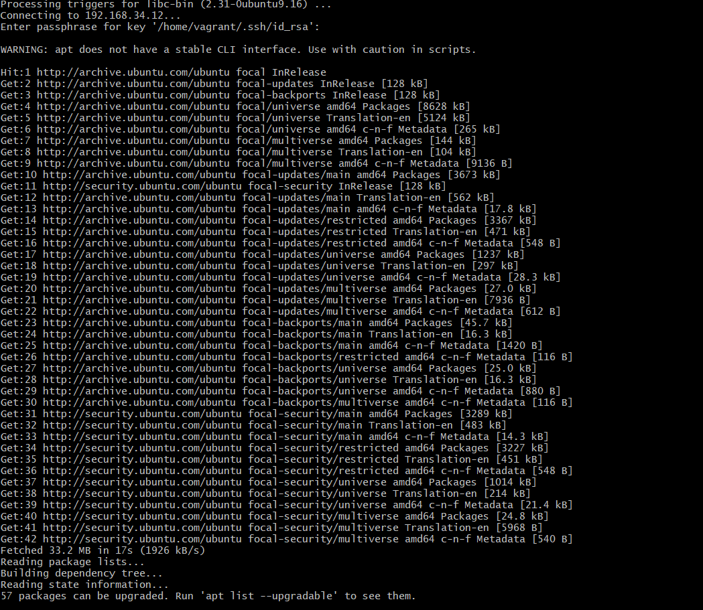
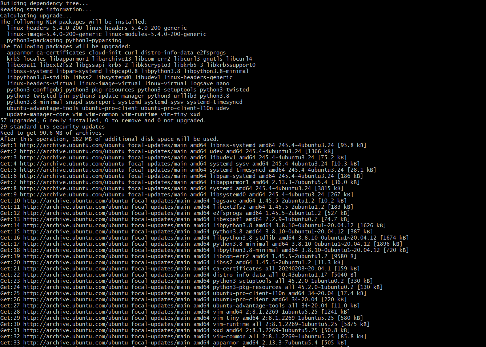
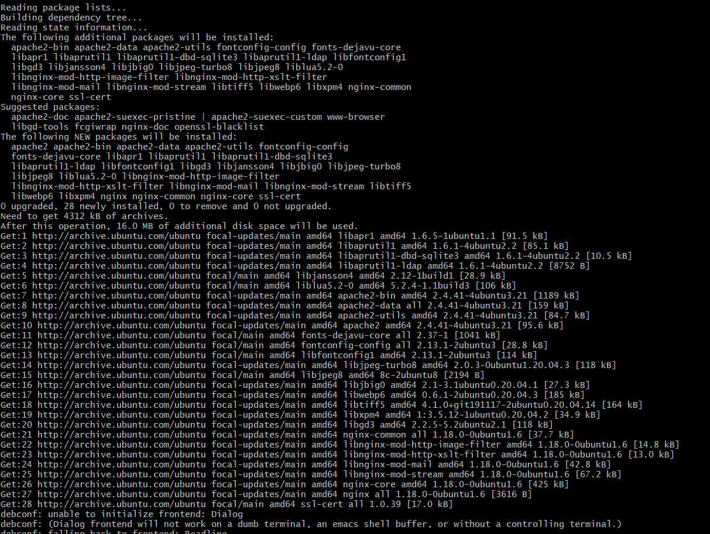
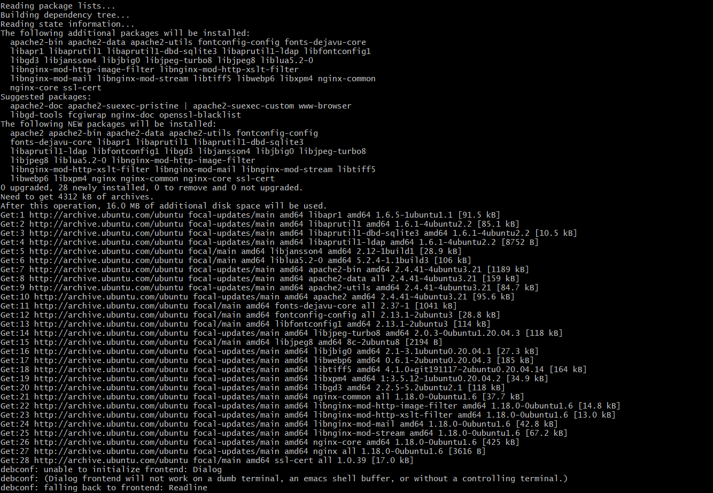

# Shell Scripting (Critical Thinking) Project

## So the idea is SSH-ing from my local machine to the bastion server and then having my bastion server SSH into each of the target servers to do the updates, upgrade and installations. Because of the low storage capacity on my local machine, my target servers are three instead of five.

## **SERVER1**

### So i ssh into server1 from the bastion server to do system updates

### Package upgrades for server1

### package installations for server1

## **SERVER2**

### System updates for server2

### Package upgrades for server2

### Package installations for server2

## **SERVER3**

### System updates for server3

### Package upgrades for server3

### Package installations for server3
